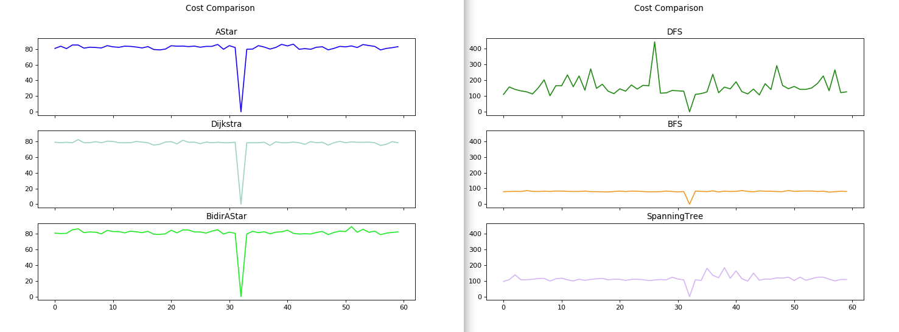

[![Contributors][contributors-shield]][contributors-url]
[![Forks][forks-shield]][forks-url]
[![Stargazers][stars-shield]][stars-url]
[![Issues][issues-shield]][issues-url]
[![MIT License][license-shield]][license-url]
[![LinkedIn][linkedin-shield]][linkedin-url]

<br />
<p align="center">
                                
</a>

  <h3 align="center">PathFinding API</h3>

  <p align="center">
    2D Pathfinding Algorithms API
    <br />
    <a href="https://github.com/master-coro/artin-pathfinding"><strong>Explore the docs »</strong></a>
    <br />
    <br />
    <a href="https://github.com/master-coro/artin-pathfinding">View Demo</a>
    ·
    <a href="https://github.com/master-coro/artin-pathfinding/issues">Report Bug</a>
    ·
    <a href="https://github.com/master-coro/artin-pathfinding/issues">Request Feature</a>
  </p>
</p>

## Table of Contents

* [About the Project](#about-the-project)
* [Setup](#setup)
* [Run](#run)
* [Roadmap](#roadmap)
* [Contribute](#contribute)
* [License](#license)
* [Contact](#contact)
* [Contributors](#contributors)

## About the Project

This API is meant to implement several pathfinding algorithms and highlight pros and cons of each of them. Whether it's computation time or shortest path, each have flaws and strengths that I wished to display with graphs. For that I encapsulated several features to make the program easy to handle.

Here is a comparison of paths' length for each implemented algorithms. ( 0 means no path was found ).
It also shows stability and displays a certain trust factors for some that others may not have.

<p align="center">
    
  </a>
</p>
<br />
<br />

This is the computation time comparison, showing that a fast computation time can hurt the path, but not necessarily. Some may have longer computation time AND longer paths. But some algorithms may not be implemented due to environment issue or lack of knowledge about the environment.
For example, you can add several walls to the environment and see many of the algorithms fail while others might be more robust.

<p align="center">
    
  </a>
</p>

## Setup

1. (Optional) Click on `Fork`
2. Clone the project on your local machine : `git clone https://github.com/master-coro/artin-pathfinding.git`
3. Install dependencies : `pip3 install -r requirements.txt`

## Run

As of now the program stores Data from several pathfinding solutions on different environments generated with the same conditions. It runs on a 70x20 matrix with 20% of available space covered by obstacles. Those obstacles change at each generated environments.

1. Run `python3 src/main.py`
2. Enjoy the data plots

## Roadmap

See the [open issues](https://github.com/master-coro/artin-pathfinding/issues) for a list of proposed features (and known issues).

## Contribute

Contributions are what make the open source community such an amazing place to learn, inspire, and create. Any contributions you make are **greatly appreciated**.

### Contribute on proposed features

1. Choose any open issue from [here](https://github.com/master-coro/artin-pathfinding/issues). 
2. Comment on the issue: `Can I work on this?` and get assigned.
3. Make changes to your `Fork` and send a PR.

Otherwise just create the issue yourself, and we'll discuss and assign you to it if serves the project !

To create a PR:

Follow the given link to make a successful and valid PR: https://help.github.com/articles/creating-a-pull-request/

To send a PR, follow these rules carefully, **otherwise your PR will be closed**:

1. Make PR title in this formats: 
```
Fixes #IssueNo : Name of Issue
``` 
```
Feature #IssueNo : Name of Issue
```
```
Enhancement #IssueNo : Name of Issue
```

According to what type of issue you believe it is.

For any doubts related to the issues, i.e., to understand the issue better etc, comment down your queries on the respective issue.

## License

Distributed under the MIT License. See `LICENSE` for more information.

## Contact

Erwin Lejeune - [@spida_rwin](https://twitter.com/spida_rwin) - erwin.lejeune15@gmail.com

## Contributors

Everyone part of the original team or that assisted throughout the development.

- [Erwin Lejeune](https://github.com/Guilyx)

[contributors-shield]: https://img.shields.io/github/contributors/master-coro/artin-pathfinding.svg?style=flat-square
[contributors-url]: https://github.com/master-coro/artin-pathfinding/graphs/contributors
[forks-shield]: https://img.shields.io/github/forks/master-coro/artin-pathfinding.svg?style=flat-square
[forks-url]: https://github.com/master-coro/artin-pathfinding/network/members
[stars-shield]: https://img.shields.io/github/stars/master-coro/artin-pathfinding.svg?style=flat-square
[stars-url]: https://github.com/master-coro/artin-pathfinding/stargazers
[issues-shield]: https://img.shields.io/github/issues/master-coro/artin-pathfinding.svg?style=flat-square
[issues-url]: https://github.com/master-coro/artin-pathfinding/issues
[license-shield]: https://img.shields.io/github/license/master-coro/artin-pathfinding.svg?style=flat-square
[license-url]: https://github.com/master-coro/artin-pathfinding/blob/master/LICENSE.md
[linkedin-shield]: https://img.shields.io/badge/-LinkedIn-black.svg?style=flat-square&logo=linkedin&colorB=555
[linkedin-url]: https://linkedin.com/in/erwinlejeune-lkn
